# وثيقة قواعد ومعايير مشروع: منظومة "بلغوا عني ولو آية" لمتابعة تحفيظ وإتقان سورة الفاتحة

> **وثيقة مرجعية حية وملزمة للمشروع - يجب قراءة هذا الملف ومراجعته بدقة قبل أي تعديل.**

---

## 📌 المبادئ والشروط الأساسية للمشروع (51 شرطاً وقاعدة ملزمة)

1. **منع التنبيهات المزعجة تماماً:** لا تستعمل `alert` ولا `confirm` أو `prompt` نهائياً؛ جميع التنبيهات والملاحظات والنوافذ التفاعلية تكون داخل التطبيق عبر مكونات UI مخصصة (Custom Modals / Toasts / Dialogs) بطريقة سلسة واحترافية وبصرية فائقة الجمال.
2. **التقنيات الأساسية:** البرنامج مبني باستخدام `HTML5`, `CSS3 (Vanilla)`, `JavaScript (Vanilla)`، وملفات التهيئة والبيانات `config.js` و `data.js` و `fatiha.js`.
3. **الخلو التام من البيانات الثابتة في الـ HTML:** ممنوع نهائياً وضع أي أسماء طالبات أو معلمات أو بيانات شخصية أو إحصائيات ثابتة داخل ملفات الـ HTML الأساسية. ملفات الـ HTML مجرد هياكل وقوالب نظيفة يتم ملؤها ديناميكياً 100% عبر الجافاسكريبت من ملفات البيانات ومحرك التطبيق.
4. **مرونة إعادة الاستخدام (White-Label):** يجب أن يكون البرنامج قابلاً للاستخدام لأي جمعية أو جهة تحفيظ أخرى فقط بتعديل `config.js` و `data.js` دون الحاجة للمس سطر كود واحد في الـ HTML أو CSS أو JS.
5. **إدارة الهوية البصرية والألوان من `config.js`:** جميع الألوان، الشعار، الأيقونات، الخطوط، والبيانات البصرية تؤخذ ديناميكياً من `config.js` وتُحقن كمتغيرات CSS (`--color-primary`, `--color-secondary`, الخ) ليتمكن المستخدم من تغيير هوية وألوان المنظومة كاملة من ملف الإعدادات مباشرة.
6. **مشغل صوتي احترافي كامل (للتلاوات والتسميع):** توفير مشغل صوتي متقدم عند إضافة ملفات التلاوات يضم: زر تشغيل/إيقاف، زر إغلاق وإلغاء المشغل بالكامل، تقديم وتأخير 10 ثوانٍ، التحكم في سرعة الصوت (0.75x, 1x, 1.25x, 1.5x, 2x)، شريط تقدم دقيق بالوقت المنقضي والمتبقي، كتم الصوت، وتصغير/تكبير.
7. **إلغاء صفحة `about.html` المستقلة:** لا توجد صفحة مستقلة لـ about.html، بل تُعرض بيانات المنظومة ونبذتها والملفات الشخصية من خلال الواجهة الرئيسية أو نوافذ تفاعلية منبثقة بسلاسة.
8. **عدم تأليف أو اختلاق نصوص أو آيات:** لا يتم وضع نصوص أو آيات قرآنية اجتهادية أو عشوائية، بل الاعتماد الحصري على بيانات ملف `fatiha.js` المستخرجة رسمياً من قاعدة بيانات مجمع الملك فهد (KFGQPC Hafs v2.0) وبخط المصحف العثماني.
9. **التحقق البرمجي التام:** التأكد من عمل كافة الأزرار، خلو الكونسول من أي أخطاء، عمل التجاوب مع كل الشاشات، واختبار الكود برمجياً.
10. **العمل بدون إنترنت (PWA):** توفير Service Worker و Manifest لتعمل واجهة المنصة بالكامل أوفلاين دون الحاجة لاتصال بالإنترنت.
11. **أدوات قراءة مريحة:** تكبير/تصغير الخط للقراءة السلسة للمشرفين والمعلمات والمسنين، مع دعم الوضع الليلي (Dark Mode) والوضع النهاري وحفظ التفضيلات.
12. **بحث وفلترة ذكية:** شريط فلاتر سريعة للبحث حسب (الاسم، الهاتف، المنطقة، المعلمة، اللغة، حالة الإتقان).
13. **نظام الحفظ المحلي والجاهزية للسحاب:** حفظ كافة السجلات في `localStorage` مع تصميم طبقة البيانات (`data.js`) بنمط الخدمات لتكون جاهزة للربط مع قاعدة بيانات سحابية (Firebase / Supabase / REST API) لاحقاً دون تعديل الواجهات.
14. **محرك التحميل والتصدير المضمون:** استخدام المكتبات القياسية المعتمدة عالمياً (`SheetJS / xlsx` للـ Excel، `jsPDF` للـ PDF، ومحرك الطباعة `@media print`) لمعالجة تصدير وتنزيل الملفات والتقارير.
15. **الجودة وخلو الأخطاء:** التأكد دائماً من عدم وجود أخطاء برمجية أو لغوية أو تصميمية، واختبار كل خاصية بدقة.
16. **السرعة وسلاسة الأداء:** يجب أن يكون البرنامج سريع الاستجابة وخفيف الوزن ويعمل بسلاسة تامة (60fps) دون أي ثقل.
17. **سهولة الاستخدام:** واجهة بديهية وواضحة جداً لكل الفئات والأعمار وموجهة للمعلمات والطالبات والمشرفين.
18. **سهولة الصيانة:** كود نظيف ومعياري ومقروء ومفصول الطبقات.
19. **سهولة التطوير:** إمكانية إضافة أقسام ومزايا جديدة مستقبلاً بكل مرونة دون كسر الهيكل القائم.
20. **الشفافية في الصعوبات:** إذا وُجد شيء صعب أو غير ممكن تقنياً، يتم إخبار المستخدم فوراً وشرح الموقف بوضوح تام وتجنب تقديم شيء ناقص.
21. **عدم التصرف العشوائي أو الاجتهاد المنفرد:** لا تظن أنك تفهم كل شيء، بل استشر المستخدم دائماً عند عدم التأكد لأن رؤيته هي الأساس.
22. **الوضوح والتركيز:** التركيز في كل حرف وطلب يُطلب في المشروع.
23. **السؤال والاستفسار الدقيق:** السؤال قبل البدء بأي تعديل حتى يتم فهم المطلوب بأعلى دقة، وإعادة السؤال إن لم تكن الإجابة واضحة.
24. **التأني وعدم التسرع:** عدم التسرع في أي خطوة، وإعطاء كل مهمة حقها الكامل من الإتقان.
25. **التخطيط المسبق:** التخطيط الدقيق قبل لمس أي كود.
26. **كتابة الخطة وعرضها:** كتابة خطة العمل مفصلة باللغة العربية وعرضها على المستخدم للموافقة.
27. **الاستماع الجيد للتعليمات:** الالتزام الحرفي بكافة التوجيهات والمتطلبات.
28. **التفكير العميق قبل القرارات:** دراسة كل قرار تصميمي أو معماري قبل تطبيقه.
29. **استعراض الحلول الممكنة:** التفكير في جميع البدائل والحلول وتقديم أفضلها.
30. **توقع النتائج:** التفكير في الآثار المترتبة على كل خيار.
31. **حساب الاحتمالات:** مراعاة حالات الاستخدام المختلفة وحالات الخطأ وانقطاع الإنترنت.
32. **إدارة المخاطر:** تجنب فقدان البيانات، توفير نسخ احتياطي JSON، وحماية تجربة المستخدم.
33. **تجربة مستخدم موجهة للجميع:** واجهة مريحة ومفهومة للصغير والكبير وغير المتخصصين تقنياً بدون أي خبرة سابقة، مع دعم تغيير أحجام الخطوط وقراءة سهلة.
34. **العمل بدون اتصال (Offline First للواجهة):** البرنامج يعمل بالكامل بدون اتصال بالإنترنت للواجهة والمحتوى والبيانات المخزنة محلياً.
35. **التوافق التام مع جميع الأجهزة (Responsive Design):** يعمل بكفاءة وتناسق كامل على الهواتف بجميع مقاساتها، والأجهزة اللوحية، والشاشات المكتبية الكبيرة.
36. **طلب النواقص فوراً:** إذا كان هناك متطلب من المستخدم (بيانات، صور، صلاحيات)، يتم طلبه مباشرة.
37. **المهارات والمكتبات الإضافية:** طلب أي مهارات (Skills) أو مكتبات إذا كانت ستثري المشروع وتفيده.
38. **تقديم الاقتراحات الأفضل:** إذا وُجد اقتراح أو تعديل أفضل من الفكرة المطروحة، يتم تقديمه للمناقشة وتوضيح فوائده.
39. **عدم التغيير دون موافقة:** لا يتم وضع شيء جديد أو تعديل جذري من الرأس بدون موافقة صريحة.
40. **مراجعة شاملة للكود:** فحص الكود بالكامل قبل تنفيذ أي تعديل لتجنب التضارب.
41. **توضيح المشكلات بالتفصيل:** شرح أي خطأ أو عائق بأسلوب مفصل ومفهوم.
42. **توثيق التغييرات بالتفصيل:** تبيان كل ما تم تعديله وسببه بدقة.
43. **التطوير التشاركي المستمر:** مشاركة التحسينات الجمالية والوظيفية باستمرار.
44. **اللغة العربية في التخطيط والواجهة:** تكون الخطط والتوثيق والواجهة باللغة العربية الفصحى الأنيقة.
45. **تطبيق ويب تقدمي (PWA):** تحويل الموقع إلى Progressive Web App قابل للتثبيت على الأجهزة، مع Service Worker و Manifest وأيقونات احترافية.
46. **قراءة هذه الوثيقة قبل أي تعديل:** الرجوع الدائم لهذه البنود والالتزام التام بروحها ونصوصها.
47. **اعتماد الفرع `main` (الحديث) في Git و GitHub:** الالتزام التام بأن يكون الفرع الأساسي للمستودع والنشر السحابي هو `main` دائماً، وتوجيه كافة سكربتات وأوامر الرفع إليه حصراً وتجنب تسمية `master` القديمة..
49. **فهرس ومحاور المتابعة المشروطة بالبيانات:** ميزة فهرس المحاور ومتابعة الآيات لا تظهر إلا بناءً على بيانات معتمدة، ويُمنع منعاً باتاً استنتاج أو توليد محاور أو عناوين اجتهادية من الرأس.
50. **خصوصية واستقلالية أدوات الإدارة:** الأدوات الإدارية الخاصة بالمشرفين والمعلمات (مثل إضافة/حذف السجلات، مسح البيانات، وتصدير التقارير العامة) تكون محمية بنظام الصلاحيات ولا تظهر إلا للمصرح لهم.
51. **استخدام المكتبات الموثوقة الجاهزة:** إذا كانت هناك مكتبة برمجية موثوقة ومفتوحة المصدر ومعتمدة عالمياً تقوم بالوظيفة المطلوبة بكفاءة واستقرار (مثل `SheetJS`, `Chart.js`, `jsPDF`)، يتم اعتمادها فوراً وتفضيلها على كتابة الأكواد اليدوية من الصفر لضمان أعلى مستوى من الاستقرار والأمان.

---

## 🏛️ الهيكلية المعمارية للمشروع

```mermaid
graph TD
    A[index.html - الواجهة الرئيسية ونظام SPA] --> B[config.js - الهوية البصرية + الألوان + المناطق المعتمدة]
    A --> C[fatiha.js - بيانات السورة الرسمية وحساب الإتقان]
    A --> D[data.js - طبقة البيانات والتخزين المحلي والجاهزية للسحاب]
    A --> E[auth.js - إدارة تسجيل الدخول والأدوار الـ 4 والصلاحيات]
    A --> F[students.js - محرك إدارة الطالبات ومتابعة الإتقان]
    A --> G[teachers.js - محرك إدارة المعلمات ولوحة الصدارة]
    A --> H[reports.js - محرك التقارير وتصدير Excel و PDF]
    A --> I[app.js - موجه التطبيق وتوليد الرسوم البيانية والإشعارات]
    A --> J[style.css - التصميم ومتغيرات الألوان والوضع الداكن والطباعة]
    A --> K[sw.js & manifest.json - التثبيت والعمل بدون إنترنت PWA]
    A --> L[uthmanic_hafs_v20.ttf - خط مجمع الملك فهد للرسم العثماني]
```

